通过VMC使用mocopi  

# mocopi

[便携动作捕捉系统 mocopi](https://www.sonystyle.com.cn/products/intelligent/mocopi/mocopi_feature.html)是索尼销售的便携，轻型的动作捕捉产品。  
VMC是mocopi正式支持的PC端软件。  
  
本页是在VMC使用mocopi的设置方法。

***

# mocopi穿戴，校准

首先启动mocopi, 按照mocopi手机端指示进行连接，穿戴。  
  
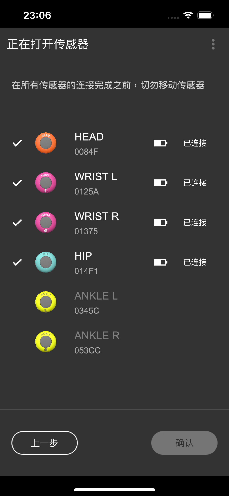  
  
**连接时请把mocopi传感器静止放置，不要触碰。**    
请确认6个传感器完全连接成功之后，再进行穿戴。    
  
下面是校准。  
  
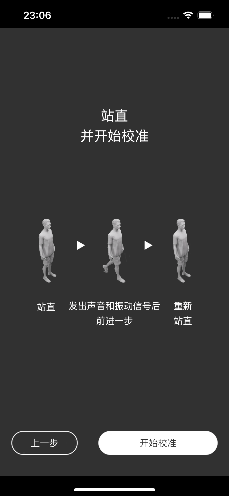  
  
手臂自然垂放在身体两侧保持静止。两脚与肩同宽站立不动。 等手机App提示，往前走一步。
  
# mocopi APP选择 “动作” 模式

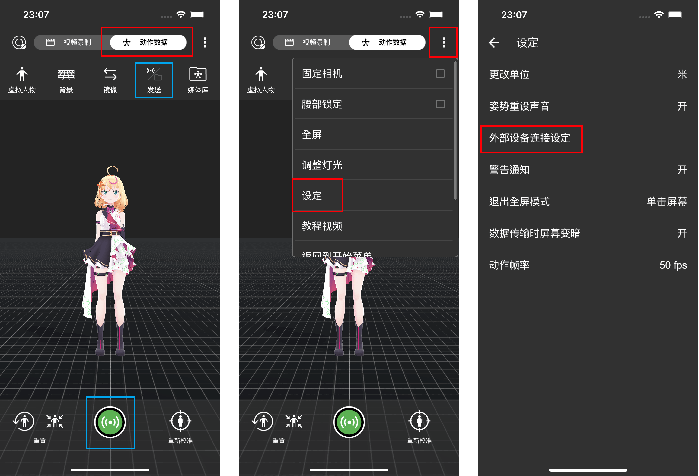  
  
最上面的[视频录制/动作数据]按钮选择「动作数据」、「发送/保存」按钮选择[发送]。  
从右上角的菜单中打开「設定」
选择「电脑连接设定」。  
  
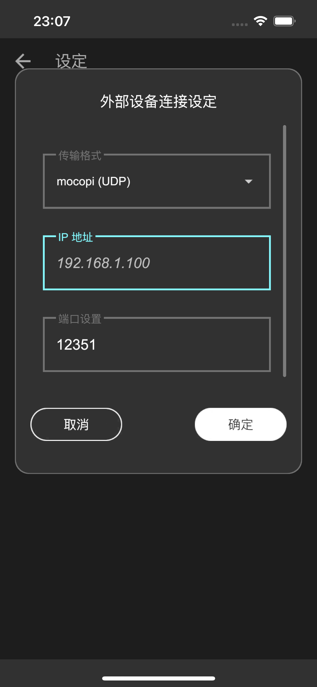  
  
请输入使用VMC的PC的IP地址。  
  

# 在PC端打开VMC

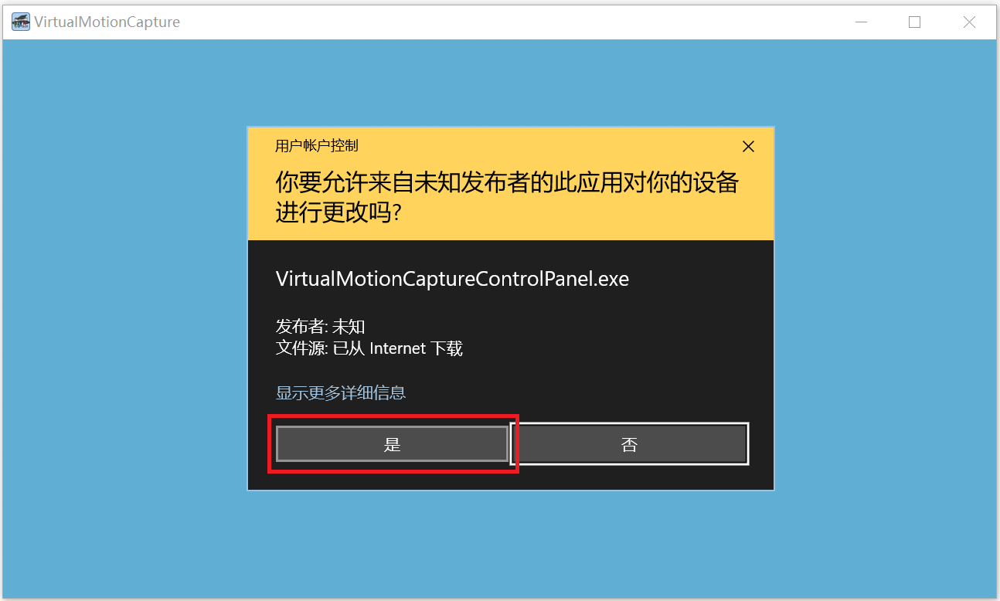  
  
第一次使用VMC的时候，会弹出防火墙的设置窗口，请选择「是」。  

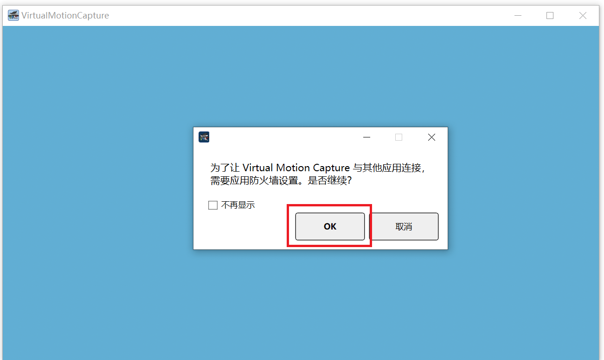  
  
为了和mocopi连接需要设置防火墙、点击「OK」。  
※如果之前取消过、请到VMC的文件见里面把 Settings/commonWPF.json文件删除再重新打开VMC软件、设置弹窗会再都出现。  

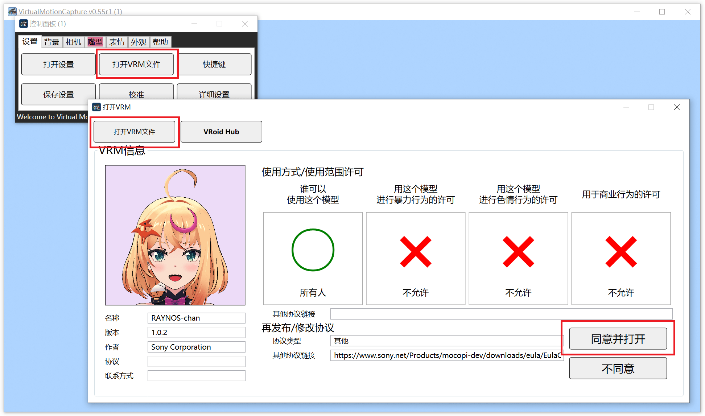  
  
打开软件后会需要选择虚拟人。以下使用Sony发布的mocopi的官方虚拟人RAYNOS酱为例。  
可以从[RAYNOS酱Avatar的下载页面](https://www.sony.net/Products/mocopi-dev/zh-cn/downloads/DownloadInfo.html#RAYNOS)下载VRM文件、  
点击控制界面的「打开VRM文件」按钮、选择下载的VRM文件，点击「同意并打开」。  
  
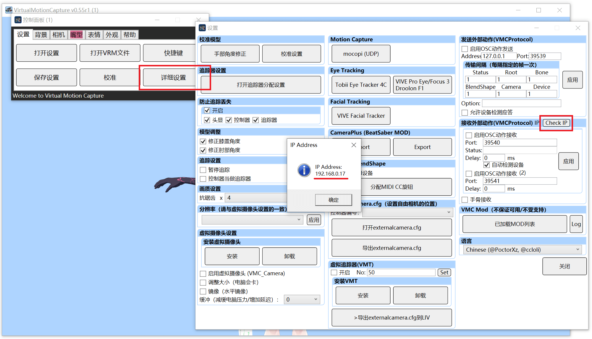  
  
点击控制界面的「詳細设置」按钮、再点击「Check IP」按钮会显示本机的IP地址。例：192.168.0.5  
在手机端的mocopi App界面上输入这个IP地址。  
  
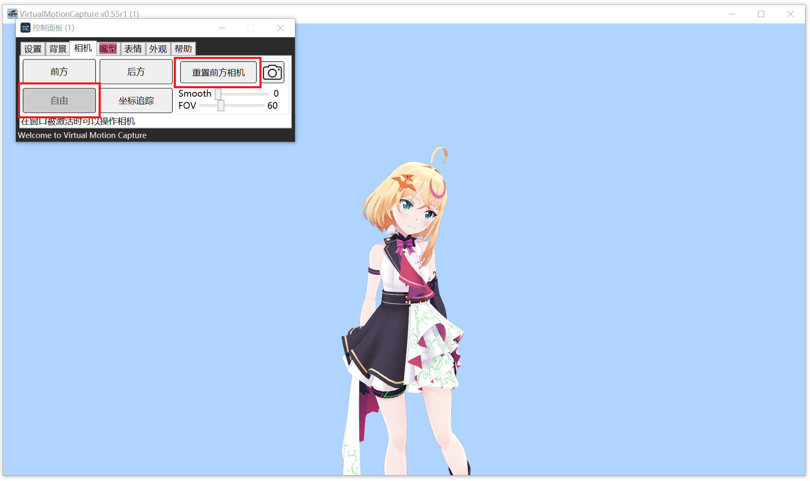  
  
这样关于mocopi的设置就完成了。点击mocopi App下面的绿色按钮开始传输动捕数据、在VMC界面的数字虚拟人就可以动了。  
在[相机]tab、点击「自由」、「重置前方相机」就可以固定摄像头位置，进行转动。   

# mocopi的详细设置

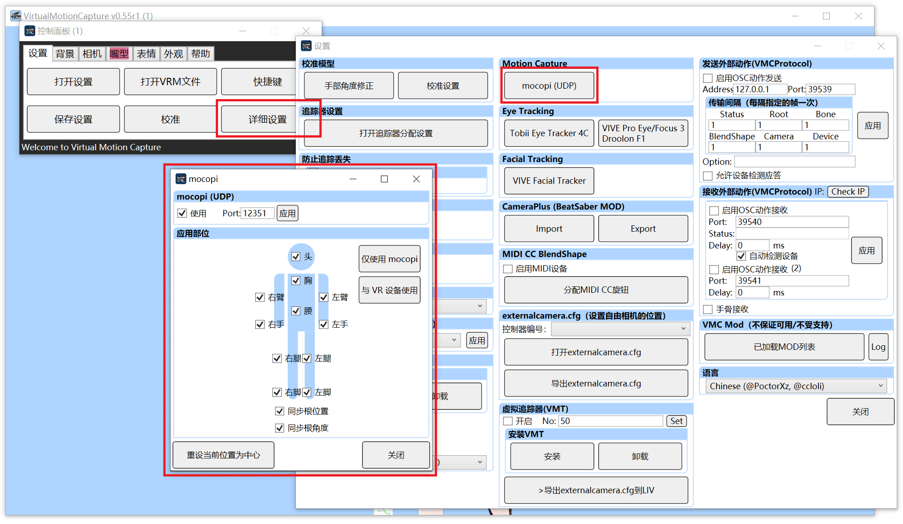  
  
点击「详细设置」的「mocopi (UDP)」按钮就可以显示mocopi的详细设置。  
可以改变端口、选择接受数据的部位选择、中心位置的重设。  

# 同时使用mocopi和VR设备

可以上半身使用VR设备，下本身使用mocopi(mocopi还是需要6个传感器全部穿戴)。  
  
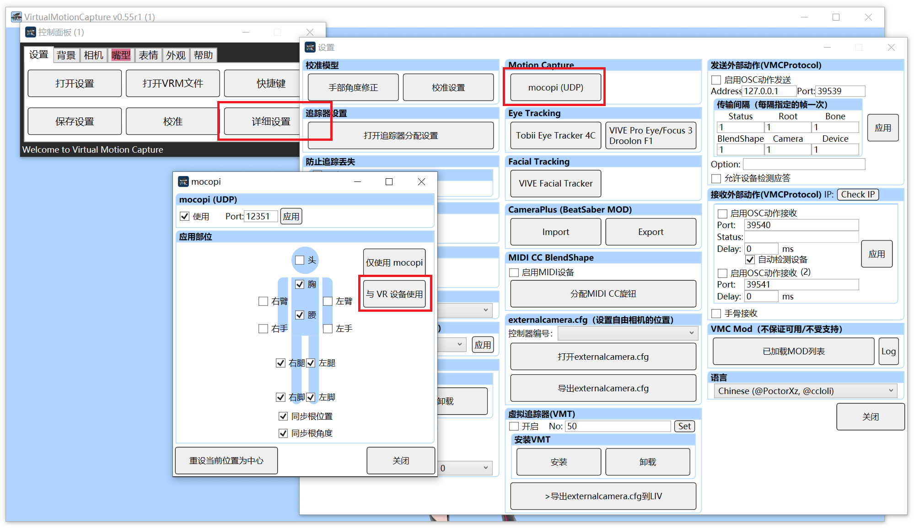  
  
点击「详细设置」的「mocopi (UDP)」按钮打开mocopi的详细设置。
点击「与VR设备使用」按钮，关于VR设备联用的设置一下子就完成了。  
  
  
  
穿戴好HMD和控制器、在控制面版界面中点击「校准」按钮、  
根据画面提出的注意事项，进行校准。  
  
这样就设置完成了。
